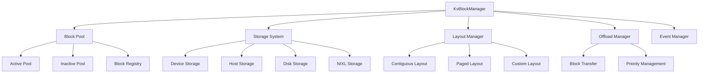
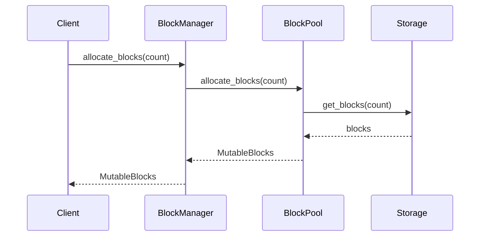
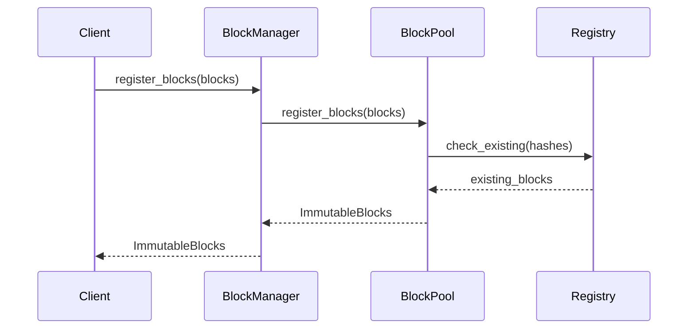

# Core Architecture Overview

The KV Block Manager is built around a modular architecture that separates concerns and provides flexibility for different deployment scenarios. This document provides a high-level overview of the core components and their interactions.

## Architecture Components

## Core Components

### 1. KvBlockManager

The main entry point that orchestrates all block management operations. It provides:

- **Block Allocation**: Request and manage blocks for inference
- **Block Registration**: Register completed blocks for reuse
- **Block Matching**: Find existing blocks that match sequence hashes
- **Storage Access**: Provide access to different storage tiers
- **Lifecycle Management**: Handle block creation, usage, and cleanup

### 2. Block Pool

Manages the lifecycle of blocks across different states:

- **Active Pool**: Tracks blocks currently in use by sequences
- **Inactive Pool**: Manages available blocks for allocation
- **Block Registry**: Maintains metadata about registered blocks
- **Priority Management**: Implements eviction strategies for block reuse

### 3. Storage System

Provides a unified interface for different storage backends:

- **Device Storage**: GPU memory management
- **Host Storage**: CPU memory management  
- **Disk Storage**: Local NVMe storage
- **NIXL Storage**: Remote storage via NIXL protocol

### 4. Layout Management

Handles data layout strategies for optimal performance:

- **Contiguous Layout**: Simple linear memory layout
- **Paged Layout**: Block-based memory organization
- **Custom Layout**: User-defined layout strategies

### 5. Offload Manager

Manages block movement between storage tiers:

- **Block Transfer**: Efficient data movement between tiers
- **Priority Management**: Intelligent offloading decisions
- **Background Processing**: Asynchronous block operations

## Data Flow

### Block Allocation Flow

### Block Registration Flow

## Key Design Principles

### 1. Separation of Concerns

Each component has a well-defined responsibility:
- **BlockManager**: High-level orchestration
- **BlockPool**: Block lifecycle management
- **Storage**: Memory management
- **Layout**: Data organization
- **Offload**: Tier management

### 2. Type Safety

The system uses Rust's type system to ensure:
- **Storage Type Safety**: Compile-time guarantees about storage types
- **Block State Safety**: Prevents invalid state transitions
- **Thread Safety**: Safe concurrent access patterns

### 3. Performance Optimization

Multiple optimization strategies:
- **Block Reuse**: Minimize memory allocation overhead
- **Efficient Layouts**: Optimize memory access patterns
- **Async Operations**: Non-blocking I/O operations
- **Smart Eviction**: Priority-based block management

### 4. Extensibility

The modular design allows for:
- **Custom Storage**: Implement new storage backends
- **Custom Layouts**: Define new data organization strategies
- **Custom Policies**: Implement custom eviction strategies
- **Plugin Architecture**: Add new functionality without core changes

## Threading Model

The KV Block Manager uses a multi-threaded architecture:

- **Main Thread**: Handles client requests and coordination
- **Background Threads**: Process async operations (offloading, cleanup)
- **Worker Threads**: Handle block transfers and I/O operations
- **Event Loop**: Manages async task scheduling

## Error Handling

The system provides comprehensive error handling:

- **Storage Errors**: Handle allocation and access failures
- **Block Errors**: Manage invalid block states
- **Network Errors**: Handle distributed operation failures
- **Recovery Mechanisms**: Automatic error recovery where possible

## Configuration

The system is highly configurable through:

- **Runtime Configuration**: Worker settings, async runtime
- **Model Configuration**: Layer count, dimensions, data types
- **Storage Configuration**: Memory allocation, storage types
- **Layout Configuration**: Data organization strategies
- **Policy Configuration**: Eviction and offloading policies

## Next Steps

- [Block Manager Details](block_manager.md) - Deep dive into the main orchestrator
- [Configuration System](configuration.md) - Learn about configuration options
- [Storage System](storage.md) - Understand storage backends
- [Block Pool](block_pool.md) - Explore block lifecycle management 