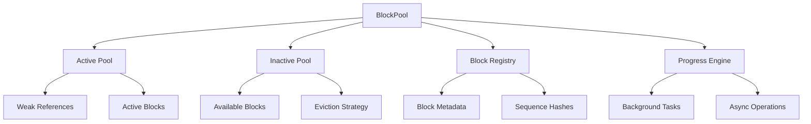

# Block Pool

The Block Pool is the core component responsible for managing the lifecycle of KV cache blocks. It provides efficient allocation, registration, and reuse of blocks through a sophisticated pool management system.

## Overview

The Block Pool consists of three main components:

- **Active Pool**: Manages blocks currently in use by sequences
- **Inactive Pool**: Manages available blocks for allocation
- **Block Registry**: Maintains metadata about registered blocks

## Architecture



## Block States

Blocks transition through several states during their lifecycle:

1. **Available**: Block is in the inactive pool and ready for allocation
2. **Allocated**: Block has been allocated and is in mutable state
3. **Registered**: Block has been registered and is in immutable state
4. **Active**: Block is being used by one or more sequences
5. **Returned**: Block has been returned to the inactive pool

## Core Operations

### Block Allocation

```rust
use dynamo_llm::block_manager::pool::BlockPool;

// Allocate blocks from pool
let mut_blocks = pool.allocate_blocks_blocking(4)?;
println!("Allocated {} blocks", mut_blocks.len());

// Async allocation
let mut_blocks = pool.allocate_blocks(4).await?;
```

### Block Registration

```rust
// Register blocks after computation
let immutable_blocks = pool.register_blocks_blocking(mut_blocks)?;
println!("Registered {} blocks", immutable_blocks.len());

// Get sequence hashes for matching
let sequence_hashes: Vec<SequenceHash> = immutable_blocks
    .iter()
    .map(|block| block.sequence_hash())
    .collect();
```

### Block Matching

```rust
// Match blocks by sequence hash
let matched_blocks = pool.match_sequence_hashes_blocking(&sequence_hashes)?;

if matched_blocks.len() == sequence_hashes.len() {
    println!("All blocks found in cache!");
} else {
    println!("Partial cache hit: {}/{} blocks found", 
            matched_blocks.len(), sequence_hashes.len());
}
```

## Pool Configuration

### Basic Pool Setup

```rust
use dynamo_llm::block_manager::pool::BlockPoolArgs;

let pool_args = BlockPoolArgs::builder()
    .blocks(initial_blocks)
    .build()?;

let pool = BlockPool::new(pool_args)?;
```

### Advanced Pool Configuration

```rust
use dynamo_llm::block_manager::{
    events::EventManager, metrics::BlockManagerMetrics
};

let pool_args = BlockPoolArgs::builder()
    .blocks(initial_blocks)
    .event_manager(Arc::new(MyEventManager::new()))
    .pool_metrics(metrics.pool("my_pool"))
    .build()?;

let pool = BlockPool::new(pool_args)?;
```

## Block Lifecycle Management

### 1. Allocation Phase

```rust
// Request blocks from pool
let mut_blocks = pool.allocate_blocks_blocking(count)?;

// Blocks are now in Mutable state
for block in &mut_blocks {
    // Fill block with computed KV cache data
    fill_block_with_data(block, kv_data);
}
```

### 2. Registration Phase

```rust
// Register blocks for reuse
let immutable_blocks = pool.register_blocks_blocking(mut_blocks)?;

// Blocks are now in Immutable state and can be shared
for block in &immutable_blocks {
    let sequence_hash = block.sequence_hash();
    // Store sequence hash for future matching
}
```

### 3. Usage Phase

```rust
// Match blocks by sequence hash
let matched_blocks = pool.match_sequence_hashes_blocking(&hashes)?;

// Use blocks for inference
for block in &matched_blocks {
    // Access block data for attention computation
    let layer_data = block.layer_view(0, 0)?;
    compute_attention(layer_data);
}
```

### 4. Cleanup Phase

```rust
// Blocks are automatically returned to pool when dropped
// No explicit cleanup needed
```

## Eviction Strategies

The inactive pool implements priority-based eviction strategies:

### LRU (Least Recently Used)

```rust
// Blocks are evicted based on last access time
// Most recently used blocks are kept in memory
```

### Priority-Based Eviction

```rust
// Blocks are evicted based on priority scores
// Higher priority blocks are kept longer
```

### Memory Pressure Eviction

```rust
// Blocks are evicted when memory pressure is high
// Lower priority blocks are evicted first
```

## Performance Optimizations

### Block Reuse

```rust
// Check cache hit rate
let total_requests = 1000;
let cache_hits = 750;
let hit_rate = cache_hits as f64 / total_requests as f64;
println!("Cache hit rate: {:.2}%", hit_rate * 100.0);
```

### Memory Efficiency

```rust
// Monitor memory usage
let total_blocks = pool.total_blocks();
let available_blocks = pool.available_blocks();
let used_blocks = total_blocks - available_blocks;
let usage_rate = used_blocks as f64 / total_blocks as f64;

println!("Memory usage: {:.2}%", usage_rate * 100.0);
```

### Async Operations

```rust
// Use async operations for better performance
let mut_blocks = pool.allocate_blocks(10).await?;
let immutable_blocks = pool.register_blocks(mut_blocks).await?;
let matched_blocks = pool.match_sequence_hashes(&hashes).await?;
```

## Error Handling

### Allocation Errors

```rust
use dynamo_llm::block_manager::pool::BlockPoolError;

match pool.allocate_blocks_blocking(count) {
    Ok(blocks) => {
        println!("Successfully allocated {} blocks", blocks.len());
    }
    Err(BlockPoolError::NotEnoughBlocksAvailable(requested, available)) => {
        println!("Not enough blocks available. Requested: {}, Available: {}", 
                requested, available);
        
        // Try to allocate what's available
        if available > 0 {
            let partial_blocks = pool.allocate_blocks_blocking(available)?;
            println!("Allocated {} blocks instead", partial_blocks.len());
        }
    }
    Err(e) => {
        println!("Allocation error: {}", e);
    }
}
```

### Registration Errors

```rust
match pool.register_blocks_blocking(mut_blocks) {
    Ok(immutable_blocks) => {
        println!("Successfully registered {} blocks", immutable_blocks.len());
    }
    Err(BlockPoolError::BlockNotComplete) => {
        println!("Cannot register incomplete blocks");
    }
    Err(BlockPoolError::InvalidMutableBlock(msg)) => {
        println!("Invalid mutable block: {}", msg);
    }
    Err(e) => {
        println!("Registration error: {}", e);
    }
}
```

## Monitoring and Metrics

### Pool Metrics

```rust
// Get pool statistics
let total_blocks = pool.total_blocks();
let available_blocks = pool.available_blocks();
let used_blocks = total_blocks - available_blocks;

println!("Pool statistics:");
println!("  Total blocks: {}", total_blocks);
println!("  Available blocks: {}", available_blocks);
println!("  Used blocks: {}", used_blocks);
println!("  Usage rate: {:.2}%", (used_blocks as f64 / total_blocks as f64) * 100.0);
```

### Performance Metrics

```rust
// Monitor allocation performance
let start = std::time::Instant::now();
let blocks = pool.allocate_blocks_blocking(100)?;
let duration = start.elapsed();

println!("Allocated 100 blocks in {:?}", duration);
println!("Average allocation time: {:?}", duration / 100);
```

## Thread Safety

The Block Pool is designed for concurrent access:

```rust
use std::sync::Arc;
use tokio::spawn;

let pool = Arc::new(pool);

// Spawn multiple tasks
let handles: Vec<_> = (0..4).map(|i| {
    let pool = pool.clone();
    spawn(async move {
        let blocks = pool.allocate_blocks_blocking(2).unwrap();
        // Process blocks...
        println!("Task {} completed", i);
    })
}).collect();

// Wait for all tasks
for handle in handles {
    handle.await.unwrap();
}
```

## Advanced Features

### Custom Eviction Policies

```rust
use dynamo_llm::block_manager::pool::EvictionPolicy;

// Implement custom eviction policy
struct CustomEvictionPolicy;

impl EvictionPolicy for CustomEvictionPolicy {
    fn should_evict(&self, block: &Block) -> bool {
        // Custom eviction logic
        block.last_access_time() < std::time::Instant::now() - Duration::from_secs(300)
    }
}
```

### Block Prefetching

```rust
// Prefetch blocks based on access patterns
async fn prefetch_blocks(pool: &BlockPool, predicted_hashes: &[SequenceHash]) {
    // Try to match predicted blocks
    let matched = pool.match_sequence_hashes(predicted_hashes).await?;
    
    // Allocate blocks for missing predictions
    let missing_count = predicted_hashes.len() - matched.len();
    if missing_count > 0 {
        let new_blocks = pool.allocate_blocks(missing_count).await?;
        // Pre-compute and register blocks
    }
}
```

### Memory Pressure Handling

```rust
// Handle memory pressure
fn handle_memory_pressure(pool: &BlockPool) {
    let usage = pool.usage_rate();
    
    if usage > 0.9 {  // 90% usage
        println!("High memory usage detected: {:.2}%", usage * 100.0);
        
        // Trigger aggressive eviction
        pool.trigger_eviction(EvictionMode::Aggressive);
    } else if usage > 0.7 {  // 70% usage
        println!("Moderate memory usage: {:.2}%", usage * 100.0);
        
        // Trigger normal eviction
        pool.trigger_eviction(EvictionMode::Normal);
    }
}
```

## Best Practices

### 1. Efficient Block Usage

```rust
// Reuse blocks when possible
let sequence_hashes = compute_sequence_hashes(tokens);
let matched_blocks = pool.match_sequence_hashes_blocking(&sequence_hashes)?;

if matched_blocks.len() == sequence_hashes.len() {
    // Use cached blocks
    use_cached_blocks(matched_blocks);
} else {
    // Allocate new blocks only for missing sequences
    let missing_count = sequence_hashes.len() - matched_blocks.len();
    let new_blocks = pool.allocate_blocks_blocking(missing_count)?;
    // Process new blocks...
}
```

### 2. Memory Management

```rust
// Monitor memory usage regularly
fn monitor_pool_health(pool: &BlockPool) {
    let usage = pool.usage_rate();
    let hit_rate = pool.cache_hit_rate();
    
    if usage > 0.8 {
        println!("Warning: High memory usage ({:.2}%)", usage * 100.0);
    }
    
    if hit_rate < 0.5 {
        println!("Warning: Low cache hit rate ({:.2}%)", hit_rate * 100.0);
    }
}
```

### 3. Error Recovery

```rust
// Implement robust error recovery
async fn robust_block_allocation(pool: &BlockPool, count: usize) -> Result<Vec<MutableBlock>, Box<dyn std::error::Error>> {
    // Try allocation with exponential backoff
    let mut retry_count = 0;
    let max_retries = 3;
    
    loop {
        match pool.allocate_blocks(count).await {
            Ok(blocks) => return Ok(blocks),
            Err(BlockPoolError::NotEnoughBlocksAvailable(requested, available)) => {
                if retry_count >= max_retries {
                    return Err("Failed to allocate blocks after retries".into());
                }
                
                // Wait before retry
                tokio::time::sleep(Duration::from_millis(100 * (1 << retry_count))).await;
                retry_count += 1;
            }
            Err(e) => return Err(e.into()),
        }
    }
}
```

## Next Steps

- [Storage System](storage.md) - Understand storage backends
- [Layout Management](layout.md) - Learn about data layout strategies
- [Offloading](offload.md) - Explore block movement between tiers
- [Events and Metrics](events_metrics.md) - Monitor pool performance 